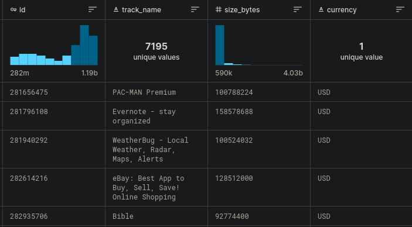
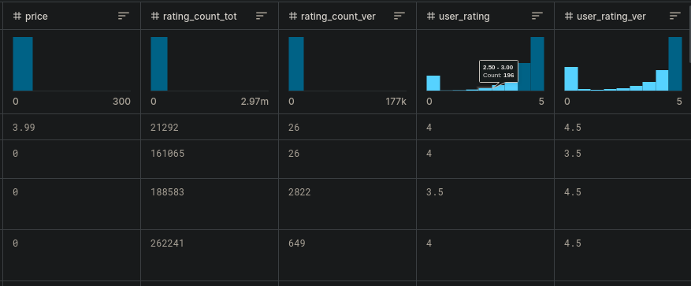

# 

---
title: "R語言資料探勘-App Store分析"
output: html_document
---

組別：E組 姓名：許嘉隆 系級：AI系大一 學號：412770116


# 前言

在當今充滿挑戰的移動應用程式市場中，深入了解應用程式的表現和使用者喜好至關重要。本資料集提供了一個豐富而詳盡的蘋果 iOS App Store 應用程式資訊，這使我們能夠進行深度資料探勘，以揭示在這個競爭激烈的領域中的一些關鍵洞察。

## 資料集背景

[資料集](https://www.kaggle.com/datasets/ramamet4/app-store-apple-data-set-10k-apps/code?datasetId=30069&sortBy=voteCount){.uri}

這份資料集是在Kaggle網站上發現的，此資料集是透過 R 和 Linux 網頁爬蟲工具，從蘋果官方網站的 iTunes 搜尋 API 中提取而來，日期為2017年7月。總共包含7197筆紀錄，每筆資料都包含16個欄位，其中包括應用程式名稱、價格、評分次數、類別等多樣資訊。

### 資料欄位：

-   **"id"**: 應用程式 ID
-   **"track_name"**: 應用程式名稱
-   **"size_bytes"**: 大小（以位元組為單位）
-   **"currency"**: 貨幣類型
-   **"price"**: 價格金額
-   **"rating_count_tot"**: 使用者評分總數（所有版本）
-   **"rating_count_ver"**: 使用者評分總數（當前版本）
-   **"user_rating"**: 平均使用者評分值（所有版本）
-   **"user_rating_ver"**: 平均使用者評分值（當前版本）
-   **"ver"**: 最新版本代碼
-   **"cont_rating"**: 內容分級
-   **"prime_genre"**: 主要類別
-   **"sup_devices.num"**: 支援裝置數量
-   **"ipadSc_urls.num"**: 用於顯示的截圖數量
-   **"lang.num"**: 支援的語言數量
-   **"vpp_lic"**: 啟用 Vpp 設備基於授權的許可





## 探勘目的

這次資料探勘的主要目的有以下幾點：

1.  **應用程式評分與詳細資訊的關聯性：** 深入研究應用程式的詳細資訊，以探究評分與特定特徵之間的相互作用，從而了解何種因素可能影響使用者對應用程式的評價。

2.  **不同類別應用程式的比較：** 對不同應用程式類別進行比較，分析它們在市場上的表現。這將有助於開發者、行銷人員和決策者了解各自類別的優勢和挑戰。

3.  **應用程式大小對評分的影響：** 探討應用程式的大小（以MB為單位）是否與評分有關聯性，這有助於我們理解使用者對於應用程式大小的接受程度。

## Set the working directory to the location of the file.

```{r}
setwd("~/Programming/coding365/R/mobileAppStore")
```

## Load libraries

```{r}
library(readr)    # For reading CSV files
library(dplyr)    # For data manipulation
library(ggplot2)  # For data visualization
```

## Load custom functions

```{r}
# Load the functions.R file, which contains some functions such as count_word
source("functions.R")
```

## Read data

```{r}
# Read csv files
app_data <- read_csv("appleStore.csv")
description_data <- read_csv("descrption.csv")
```

## Data preprocessing

```{r}
# Add some new data columns
app_data <- app_data %>%
  mutate(price_TWD = price * 31.1,                        # Price TWD
         is_free = ifelse(price == 0, TRUE, FALSE),       # Is the price free
         size_megabytes = size_bytes / (1024*1024)) %>%   # MB of app size
  merge(description_data, by = 'id') %>%                  # Merge description to app_data
  mutate(desc_length = sapply(app_desc, count_word)) %>%  # Description length
  mutate(size_category = cut(size_megabytes, breaks = c(0, 10, 50, 100, 500, 1000, 5000, Inf),
                             labels = c("0~10MB", "10~50MB", "50~100MB", "100~500MB", "500~1000MB", "1000~5000MB", "5000MB+")))
```

## Check data structure

```{r}
# Check the structure of app_data
str(app_data)
```

## Distribution of App Ratings

```{r}
ggplot(app_data, aes(x = user_rating)) +
  geom_histogram(binwidth = 0.5, fill = "#f39931", color = "#555555") +
  labs(title = "Distribution of App Ratings",
       x = "User Rating",
       y = "Number of Apps") +
  theme_minimal()
```

可以發現大多App的使用者評分好評居多。

## Percentage Distribution of App Genres

```{r}
# Calculate the percentage of each app genre
genre_percentage <- app_data %>%
  group_by(prime_genre) %>%
  summarise(app_count = n()) %>%
  mutate(percentage = (app_count / sum(app_count)) * 100)

# Create a bar plot of the percentage distribution of app genres
# The negative sign - is used to sort in descending order.
ggplot(genre_percentage, aes(x = reorder(prime_genre, -percentage), y = percentage, fill = prime_genre)) +
  geom_bar(stat = "identity", width = 1) +
  labs(title = "Percentage Distribution of App Genres",
       x = "App Genre",
       y = "Percentage of Apps") +
  theme_minimal() +
  theme(axis.text.x = element_text(angle = 45, hjust = 1)) +
  scale_fill_viridis_d()
```

遊戲類型 App的佔比最多，其次是娛樂，教育。

## Relationship between Price and App Size(MB)

```{r}
# Filter out rows with user_rating equal to zero
filtered_data <- subset(app_data, user_rating != 0)

# Plot the relationship between App Size(MB) and User Rating
ggplot(filtered_data, aes(x = size_megabytes, y = user_rating)) +
  geom_point() +
  geom_smooth(method = "lm") +
  labs(title = "Relationship between App Size(MB) and User Rating", x = "App Size(MB)", y = "User Rating")

```

利用線性回歸直線，可以發現App大小與使用者評分成正相關，雖然相關性不大。

## Mean Size for Each Genre

```{r}
# Calculate the mean size_megabytes and mean user_rating for each genre
genre_means <- app_data %>%
  group_by(prime_genre) %>%
  summarise(mean_size = mean(size_megabytes), mean_rating = mean(user_rating, na.rm = TRUE))

# Bar chart of the mean size_megabytes for each genre
ggplot(genre_means, aes(x = reorder(prime_genre, -mean_size))) +
  geom_bar(aes(y = mean_size), stat = "identity", fill = '#aa3521', alpha = 0.7) +
  labs(title = "Mean App Size(MB) of Each Genre",
       x = "App Genre",
       y = NULL) +
  scale_y_continuous(sec.axis = sec_axis(~ ., name = "Mean App Size")) +
  theme_minimal() +
  theme(axis.text.x = element_text(angle = 45, hjust = 1))
```

可以發現醫學以及遊戲類型的平均應用程式大小最高。

## Mean User Rating for Each Genre

```{r}
# Bar chart of the mean user_rating for each genre
ggplot(genre_means, aes(x = reorder(prime_genre, -mean_rating))) +
  geom_bar(aes(y = mean_rating), stat = "identity", fill = '#133183', alpha = 0.8) +
  labs(title = "Mean User Rating of Each Genre",
       x = "App Genre",
       y = NULL) +
  scale_y_continuous(sec.axis = sec_axis(~ ., name = "Mean User Rating")) +
  theme_minimal() +
  theme(axis.text.x = element_text(angle = 45, hjust = 1))
```

可以發現，生產力以及音樂類型的App平均評分最高，而金融以及目錄類型的App最低。

## 結論

-   從以上圖表可以發現，大多數的應用程式獲得的使用者評分都傾向於較高的評價。
-   遊戲類型的應用程式佔據了主要的市場份額，其次是娛樂和教育類型的應用程式。
-   使用線性回歸直線的分析顯示，應用程式的大小與使用者評分之間存在正相關性，儘管相關性並不是非常強烈。
-   在平均評分方面，生產力和音樂類型的應用程式表現最佳，而金融和目錄類型的應用程式則呈現相對較低的評價。

這些洞察為應用程式市場的理解提供了一個基本框架，並突顯了一些類別之間的差異性。此外，雖然應用程式大小對於評分有些微的正相關，但這種相關性並不是決定性的因素，其他因素可能更加重要，但還需要繼續尋找。
